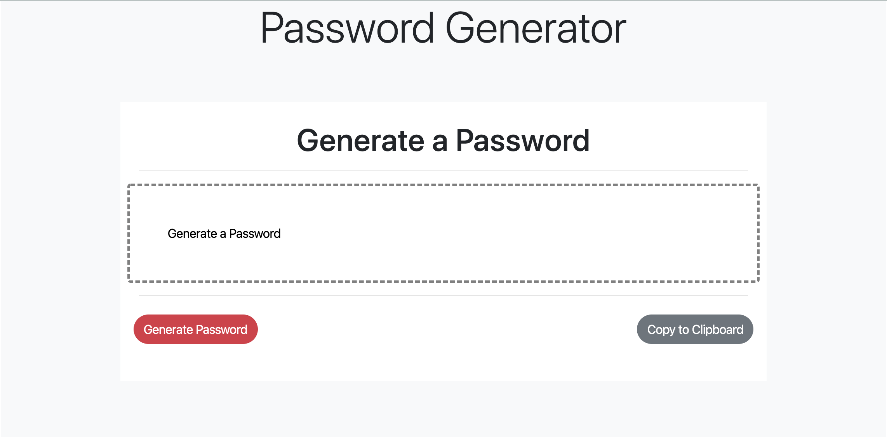

# HW3
HW3 Password Generator

## Description

This application generates a random password based on user-selected criteria. This app runs in the browser and feature dynamically updated HTML and CSS powered by JavaScript code.

The user will be prompted to choose from the following password criteria:

* Length (must be between 8 and 128 characters)

* Character type:

  * Special characters 

  * Numeric characters

  * Lowercase characters

  * Uppercase characters

The application validates user input and ensures that at least one character type is selected.

Once all prompts are answered, the user will be presented with a password matching the answered prompts. 

The user has the option to click the copy button to copy the password to their clipboard.

https://drsiles92.github.io/HW3/
